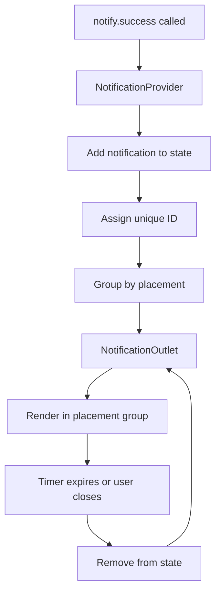
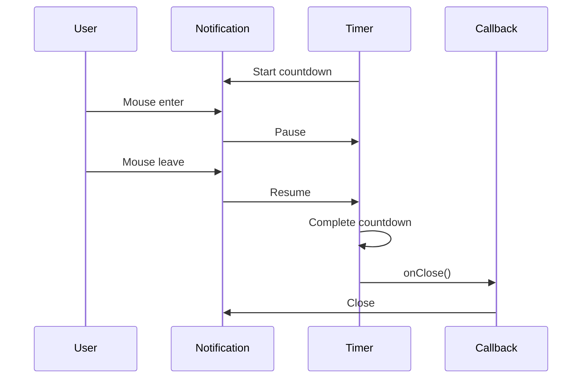

# Design Document: React Alerts Components

## Overview

This design document specifies the implementation of Alert and Notification components for the Yasamen React library. The implementation ports functionality from the existing Razor/Blazor Alerts components while adapting to React patterns and the existing Yasamen architecture.

The alerts system provides multiple components for displaying user feedback: Badge for inline labels and status indicators, Notification for dismissible alerts with timers, Feedback for structured message boxes, and a programmatic notification system with context-based state management for showing notifications at various screen positions.

### Key Design Principles

1. **Component Variety**: Provide Badge, Notification, Feedback, and NotificationContent components for different use cases
2. **Context-Based Notification System**: Use React Context for programmatic notification management
3. **Timer Management**: Implement auto-close timers with pause/resume on hover
4. **Controlled/Uncontrolled Pattern**: Support both controlled and uncontrolled Notification components
5. **Accessibility First**: Implement proper ARIA roles, labels, and keyboard navigation
6. **Consistency**: Follow existing Yasamen patterns (CSS classes, TypeScript types, hooks)

## Architecture

### Component Hierarchy

```
Badge (standalone component)

Notification (standalone component with ref control)
├── NotificationHandle (ref interface)

NotificationContent (helper component)

Feedback (standalone component)

Notification System:
├── NotificationProvider (context provider)
├── useNotify (hook for programmatic API)
├── NotificationOutlet (renders active notifications)
└── NotificationContext (internal context)
```

### Notification System State Flow



### Timer Pause/Resume Flow



## Components and Interfaces

### 1. Badge Component

Inline component for labels, status indicators, and tags.

```typescript
// Badge.tsx
export interface BadgeProps {
    /** Text content (alternative to children) */
    text?: string;
    
    /** React children content */
    children?: React.ReactNode;
    
    /** Icon component or element */
    icon?: React.ReactNode;
    
    /** Icon position relative to content */
    iconPosition?: IconPosition;
    
    /** Visual theme variant */
    theme?: Theme;
    
    /** Size variant */
    size?: Size;
    
    /** Custom CSS class */
    className?: string;
}

const Badge: React.FC<BadgeProps> = ({
    text,
    children,
    icon,
    iconPosition = 'start',
    theme = 'primary',
    size = 'medium',
    className = '',
}) => {
    // Validate iconPosition
    if (iconPosition === 'center') {
        throw new Error('Badge: iconPosition="center" is not supported. Use "start" or "end".');
    }

    const content = text || children;

    const classes = [
        BadgeClasses.Base,
        BadgeClasses.Theme[theme],
        BadgeClasses.Size[size],
        className
    ].filter(Boolean).join(' ');

    return (
        <div className={classes}>
            {icon && iconPosition === 'start' && (
                <span className={BadgeClasses.Icon}>{icon}</span>
            )}
            {content && <span className={BadgeClasses.Content}>{content}</span>}
            {icon && iconPosition === 'end' && (
                <span className={BadgeClasses.Icon}>{icon}</span>
            )}
        </div>
    );
};

export default Badge;
```

### 2. Notification Component

Dismissible alert with optional timer and progress bar.

```typescript
// Notification.tsx
export interface NotificationProps {
    /** Text content (alternative to children) */
    text?: string;
    
    /** React children content */
    children?: React.ReactNode;
    
    /** Visual theme variant */
    theme?: Theme;
    
    /** Show theme-appropriate icon */
    icon?: boolean;
    
    /** Auto-close timer in milliseconds */
    timer?: number;
    
    /** Close when notification is clicked */
    closeOnClick?: boolean;
    
    /** Show close button */
    closeable?: boolean;
    
    /** Initial closed state (uncontrolled) */
    startClosed?: boolean;
    
    /** Controlled open state */
    open?: boolean;
    
    /** Callback when notification opens */
    onOpen?: () => void;
    
    /** Callback when notification closes */
    onClose?: () => void;
    
    /** Custom CSS class */
    className?: string;
}

export interface NotificationHandle {
    open: () => void;
    close: () => void;
}

const Notification = React.forwardRef<NotificationHandle, NotificationProps>(
    (
        {
            text,
            children,
            theme = 'info',
            icon = false,
            timer,
            closeOnClick = false,
            closeable = false,
            startClosed = false,
            open: controlledOpen,
            onOpen,
            onClose,
            className = '',
        },
        ref
    ) => {
        const isControlled = controlledOpen !== undefined;
        const [internalOpen, setInternalOpen] = useState(!startClosed);
        const isOpen = isControlled ? controlledOpen : internalOpen;

        const timerRef = useRef<NodeJS.Timeout | null>(null);
        const startTimeRef = useRef<number>(0);
        const remainingTimeRef = useRef<number>(timer || 0);
        const [timerProgress, setTimerProgress] = useState(100);

        const open = useCallback(() => {
            if (!isControlled) {
                setInternalOpen(true);
            }
            onOpen?.();
        }, [isControlled, onOpen]);

        const close = useCallback(() => {
            if (!isControlled) {
                setInternalOpen(false);
            }
            onClose?.();
        }, [isControlled, onClose]);

        // Expose methods via ref
        useImperativeHandle(ref, () => ({
            open,
            close,
        }));

        // Timer logic
        useEffect(() => {
            if (!isOpen || !timer) return;

            remainingTimeRef.current = timer;
            startTimeRef.current = Date.now();

            const startTimer = () => {
                timerRef.current = setTimeout(() => {
                    close();
                }, remainingTimeRef.current);
            };

            startTimer();

            return () => {
                if (timerRef.current) {
                    clearTimeout(timerRef.current);
                }
            };
        }, [isOpen, timer, close]);

        // Timer progress animation
        useEffect(() => {
            if (!isOpen || !timer) return;

            const interval = setInterval(() => {
                const elapsed = Date.now() - startTimeRef.current;
                const progress = Math.max(0, 100 - (elapsed / timer) * 100);
                setTimerProgress(progress);
            }, 50);

            return () => clearInterval(interval);
        }, [isOpen, timer]);

        const handleMouseEnter = () => {
            if (timerRef.current && timer) {
                clearTimeout(timerRef.current);
                const elapsed = Date.now() - startTimeRef.current;
                remainingTimeRef.current = timer - elapsed;
            }
        };

        const handleMouseLeave = () => {
            if (timer && remainingTimeRef.current > 0) {
                startTimeRef.current = Date.now();
                timerRef.current = setTimeout(() => {
                    close();
                }, remainingTimeRef.current);
            }
        };

        const handleClick = () => {
            if (closeOnClick) {
                close();
            }
        };

        const handleCloseClick = (e: React.MouseEvent) => {
            e.stopPropagation();
            close();
        };

        if (!isOpen) {
            return null;
        }

        const content = text || children;

        const classes = [
            NotificationClasses.Base,
            NotificationClasses.Theme[theme],
            className
        ].filter(Boolean).join(' ');

        return (
            <div
                role="alert"
                className={classes}
                onClick={handleClick}
                onMouseEnter={handleMouseEnter}
                onMouseLeave={handleMouseLeave}
            >
                <div className={NotificationClasses.Box}>
                    {icon ? (
                        <div className={NotificationClasses.Icon}>
                            {/* Theme-appropriate icon */}
                        </div>
                    ) : (
                        <div className={NotificationClasses.Bar} />
                    )}
                    <div className={NotificationClasses.Content}>{content}</div>
                    {closeable && (
                        <div className={NotificationClasses.Close}>
                            <button
                                type="button"
                                onClick={handleCloseClick}
                                aria-label="Close notification"
                            >
                                ×
                            </button>
                        </div>
                    )}
                </div>
                {timer && (
                    <div
                        className={NotificationClasses.Timer}
                        style={{ width: `${timerProgress}%` }}
                        role="progressbar"
                        aria-valuenow={timerProgress}
                        aria-valuemin={0}
                        aria-valuemax={100}
                    />
                )}
            </div>
        );
    }
);

export default Notification;
```

### 3. NotificationContent Component

Helper component for structured notification content.

```typescript
// NotificationContent.tsx
export interface NotificationContentProps {
    /** Main message text */
    text?: string;
    
    /** Additional details text */
    details?: string;
}

const NotificationContent: React.FC<NotificationContentProps> = ({
    text,
    details,
}) => {
    return (
        <div className={NotificationContentClasses.Group}>
            {text && (
                <div className={NotificationContentClasses.Text}>{text}</div>
            )}
            {details && (
                <div className={NotificationContentClasses.Details}>{details}</div>
            )}
        </div>
    );
};

export default NotificationContent;
```

### 4. Feedback Component

Structured message box with title, text, icon, and optional close button.

```typescript
// Feedback.tsx
export interface FeedbackProps {
    /** Title text */
    title?: string;
    
    /** Body text */
    text?: string;
    
    /** React children content */
    children?: React.ReactNode;
    
    /** Icon component or element */
    icon?: React.ReactNode;
    
    /** Visual theme variant */
    theme?: Theme;
    
    /** Size variant (affects heading level) */
    size?: Size;
    
    /** Show close button */
    closeable?: boolean;
    
    /** Full-width display */
    block?: boolean;
    
    /** Callback when feedback closes */
    onClose?: () => void;
    
    /** Custom CSS class */
    className?: string;
}

const Feedback: React.FC<FeedbackProps> = ({
    title,
    text,
    children,
    icon,
    theme = 'info',
    size = 'medium',
    closeable = false,
    block = true,
    onClose,
    className = '',
}) => {
    const [isOpen, setIsOpen] = useState(true);

    const handleClose = () => {
        setIsOpen(false);
        onClose?.();
    };

    if (!isOpen) {
        return null;
    }

    // Determine heading level based on size
    const getHeadingLevel = (): 'h2' | 'h3' | 'h4' | 'h5' | 'h6' => {
        switch (size) {
            case 'largest':
            case 'larger':
                return 'h2';
            case 'large':
            case 'medium':
                return 'h3';
            case 'small':
                return 'h4';
            case 'smaller':
                return 'h5';
            case 'smallest':
                return 'h6';
            default:
                return 'h3';
        }
    };

    const HeadingTag = getHeadingLevel();

    const classes = [
        FeedbackClasses.Base,
        FeedbackClasses.Theme[theme],
        FeedbackClasses.Size[size],
        block ? FeedbackClasses.Block : '',
        className
    ].filter(Boolean).join(' ');

    return (
        <div role="alert" className={classes}>
            {icon && (
                <div className={FeedbackClasses.Icon}>{icon}</div>
            )}
            <div className={FeedbackClasses.Content}>
                {title && (
                    <HeadingTag className={FeedbackClasses.Title}>
                        {title}
                    </HeadingTag>
                )}
                {text && (
                    <p className={FeedbackClasses.Text}>{text}</p>
                )}
                {children}
            </div>
            {closeable && (
                <button
                    type="button"
                    onClick={handleClose}
                    aria-label="Close feedback"
                    className={FeedbackClasses.CloseButton}
                >
                    ×
                </button>
            )}
        </div>
    );
};

export default Feedback;
```

### 5. Notification System - Context and Provider

```typescript
// notification-context.ts
export interface NotificationItem {
    id: string;
    theme: Theme;
    placement: Placement;
    text?: string;
    details?: string;
    icon?: boolean;
    timer?: number;
    closeOnClick?: boolean;
    closeable?: boolean;
    onClose?: () => void;
    onOpen?: () => void;
}

interface NotificationContextValue {
    notifications: NotificationItem[];
    addNotification: (notification: Omit<NotificationItem, 'id'>) => string;
    removeNotification: (id: string) => void;
}

const NotificationContext = createContext<NotificationContextValue | null>(null);

export function useNotificationContext(): NotificationContextValue {
    const context = useContext(NotificationContext);
    if (!context) {
        throw new Error('useNotificationContext must be used within NotificationProvider');
    }
    return context;
}

// NotificationProvider.tsx
export const NotificationProvider: React.FC<{ children: React.ReactNode }> = ({
    children,
}) => {
    const [notifications, setNotifications] = useState<NotificationItem[]>([]);

    const addNotification = useCallback((notification: Omit<NotificationItem, 'id'>) => {
        const id = `notification-${Date.now()}-${Math.random()}`;
        const newNotification: NotificationItem = { ...notification, id };
        setNotifications((prev) => [...prev, newNotification]);
        return id;
    }, []);

    const removeNotification = useCallback((id: string) => {
        setNotifications((prev) => prev.filter((n) => n.id !== id));
    }, []);

    const value = {
        notifications,
        addNotification,
        removeNotification,
    };

    return (
        <NotificationContext.Provider value={value}>
            {children}
        </NotificationContext.Provider>
    );
};
```

### 6. useNotify Hook

Programmatic API for showing notifications.

```typescript
// use-notify.ts
export interface NotifyService {
    show: (config: Omit<NotificationItem, 'id'>) => string;
    primary: (text: string, details?: string, config?: Partial<NotificationItem>) => string;
    secondary: (text: string, details?: string, config?: Partial<NotificationItem>) => string;
    tertiary: (text: string, details?: string, config?: Partial<NotificationItem>) => string;
    success: (text: string, details?: string, config?: Partial<NotificationItem>) => string;
    danger: (text: string, details?: string, config?: Partial<NotificationItem>) => string;
    warning: (text: string, details?: string, config?: Partial<NotificationItem>) => string;
    alert: (text: string, details?: string, config?: Partial<NotificationItem>) => string;
    info: (text: string, details?: string, config?: Partial<NotificationItem>) => string;
    highlight: (text: string, details?: string, config?: Partial<NotificationItem>) => string;
    light: (text: string, details?: string, config?: Partial<NotificationItem>) => string;
    dark: (text: string, details?: string, config?: Partial<NotificationItem>) => string;
}

function calculateAutoTimer(text: string): number {
    const minDuration = 3000;
    const msPerChar = 50;
    return minDuration + text.length * msPerChar;
}

export function useNotify(): NotifyService {
    const { addNotification } = useNotificationContext();

    const show = useCallback(
        (config: Omit<NotificationItem, 'id'>) => {
            const finalConfig = {
                ...config,
                timer: config.timer ?? calculateAutoTimer(config.text || ''),
            };
            return addNotification(finalConfig);
        },
        [addNotification]
    );

    const createThemeMethod = (theme: Theme) => {
        return (
            text: string,
            details?: string,
            config?: Partial<NotificationItem>
        ) => {
            return show({
                theme,
                text,
                details,
                placement: 'top-end',
                icon: true,
                closeable: true,
                ...config,
            });
        };
    };

    return {
        show,
        primary: createThemeMethod('primary'),
        secondary: createThemeMethod('secondary'),
        tertiary: createThemeMethod('tertiary'),
        success: createThemeMethod('success'),
        danger: createThemeMethod('danger'),
        warning: createThemeMethod('warning'),
        alert: createThemeMethod('alert'),
        info: createThemeMethod('info'),
        highlight: createThemeMethod('highlight'),
        light: createThemeMethod('light'),
        dark: createThemeMethod('dark'),
    };
}
```

### 7. NotificationOutlet Component

Renders all active notifications grouped by placement.

```typescript
// NotificationOutlet.tsx
export const NotificationOutlet: React.FC = () => {
    const { notifications, removeNotification } = useNotificationContext();

    // Group notifications by placement
    const groupedNotifications = useMemo(() => {
        const groups: Record<Placement, NotificationItem[]> = {
            'top-start': [],
            'top-center': [],
            'top-end': [],
            'bottom-start': [],
            'bottom-center': [],
            'bottom-end': [],
        };

        notifications.forEach((notification) => {
            groups[notification.placement].push(notification);
        });

        return groups;
    }, [notifications]);

    const placements: Placement[] = [
        'top-start',
        'top-center',
        'top-end',
        'bottom-start',
        'bottom-center',
        'bottom-end',
    ];

    return (
        <>
            {placements.map((placement) => {
                const items = groupedNotifications[placement];
                if (items.length === 0) return null;

                return (
                    <div
                        key={placement}
                        className={`${NotificationGroupClasses.Base} ${NotificationGroupClasses.Placement[placement]}`}
                    >
                        {items.map((item) => (
                            <Notification
                                key={item.id}
                                theme={item.theme}
                                icon={item.icon}
                                timer={item.timer}
                                closeOnClick={item.closeOnClick}
                                closeable={item.closeable}
                                onOpen={item.onOpen}
                                onClose={() => {
                                    item.onClose?.();
                                    removeNotification(item.id);
                                }}
                            >
                                {item.details ? (
                                    <NotificationContent
                                        text={item.text}
                                        details={item.details}
                                    />
                                ) : (
                                    item.text
                                )}
                            </Notification>
                        ))}
                    </div>
                );
            })}
        </>
    );
};
```

## Data Models

### Enums and Types

```typescript
// alert-types.ts

export const Themes = {
    Primary: 'primary',
    Secondary: 'secondary',
    Tertiary: 'tertiary',
    Success: 'success',
    Danger: 'danger',
    Warning: 'warning',
    Alert: 'alert',
    Info: 'info',
    Highlight: 'highlight',
    Light: 'light',
    Dark: 'dark',
} as const;

export type Theme = typeof Themes[keyof typeof Themes];

export const Sizes = {
    Smallest: 'smallest',
    Smaller: 'smaller',
    Small: 'small',
    Medium: 'medium',
    Large: 'large',
    Larger: 'larger',
    Largest: 'largest',
} as const;

export type Size = typeof Sizes[keyof typeof Sizes];

export const IconPositions = {
    Start: 'start',
    End: 'end',
} as const;

export type IconPosition = typeof IconPositions[keyof typeof IconPositions];

export const Placements = {
    TopStart: 'top-start',
    TopCenter: 'top-center',
    TopEnd: 'top-end',
    BottomStart: 'bottom-start',
    BottomCenter: 'bottom-center',
    BottomEnd: 'bottom-end',
} as const;

export type Placement = typeof Placements[keyof typeof Placements];
```

### CSS Classes

```typescript
// badge-classes.ts
export const BadgeClasses = {
    Base: 'ya-badge',
    Icon: 'ya-badge-icon',
    Content: 'ya-badge-content',
    Theme: {
        primary: 'ya-badge-primary',
        secondary: 'ya-badge-secondary',
        tertiary: 'ya-badge-tertiary',
        success: 'ya-badge-success',
        danger: 'ya-badge-danger',
        warning: 'ya-badge-warning',
        alert: 'ya-badge-alert',
        info: 'ya-badge-info',
        highlight: 'ya-badge-highlight',
        light: 'ya-badge-light',
        dark: 'ya-badge-dark',
    },
    Size: {
        smallest: 'ya-badge-smallest',
        smaller: 'ya-badge-smaller',
        small: 'ya-badge-small',
        medium: 'ya-badge-medium',
        large: 'ya-badge-large',
        larger: 'ya-badge-larger',
        largest: 'ya-badge-largest',
    },
} as const;

// notification-classes.ts
export const NotificationClasses = {
    Base: 'ya-notification',
    Box: 'ya-notification-box',
    Icon: 'ya-notification-icon',
    Bar: 'ya-notification-bar',
    Content: 'ya-notification-content',
    Close: 'ya-notification-close',
    Timer: 'ya-notification-timer',
    Theme: {
        primary: 'ya-notification-primary',
        secondary: 'ya-notification-secondary',
        tertiary: 'ya-notification-tertiary',
        success: 'ya-notification-success',
        danger: 'ya-notification-danger',
        warning: 'ya-notification-warning',
        alert: 'ya-notification-alert',
        info: 'ya-notification-info',
        highlight: 'ya-notification-highlight',
        light: 'ya-notification-light',
        dark: 'ya-notification-dark',
    },
} as const;

// notification-content-classes.ts
export const NotificationContentClasses = {
    Group: 'ya-notification-content-group',
    Text: 'ya-notification-content-text',
    Details: 'ya-notification-content-details',
} as const;

// feedback-classes.ts
export const FeedbackClasses = {
    Base: 'ya-feedback',
    Icon: 'ya-feedback-icon',
    Content: 'ya-feedback-content',
    Title: 'ya-feedback-title',
    Text: 'ya-feedback-text',
    Block: 'ya-feedback-block',
    CloseButton: 'ya-feedback-close',
    Theme: {
        primary: 'ya-feedback-primary',
        secondary: 'ya-feedback-secondary',
        tertiary: 'ya-feedback-tertiary',
        success: 'ya-feedback-success',
        danger: 'ya-feedback-danger',
        warning: 'ya-feedback-warning',
        alert: 'ya-feedback-alert',
        info: 'ya-feedback-info',
        highlight: 'ya-feedback-highlight',
        light: 'ya-feedback-light',
        dark: 'ya-feedback-dark',
    },
    Size: {
        smallest: 'ya-feedback-smallest',
        smaller: 'ya-feedback-smaller',
        small: 'ya-feedback-small',
        medium: 'ya-feedback-medium',
        large: 'ya-feedback-large',
        larger: 'ya-feedback-larger',
        largest: 'ya-feedback-largest',
    },
} as const;

// notification-group-classes.ts
export const NotificationGroupClasses = {
    Base: 'ya-notification-group',
    Placement: {
        'top-start': 'ya-notification-group-top-start',
        'top-center': 'ya-notification-group-top-center',
        'top-end': 'ya-notification-group-top-end',
        'bottom-start': 'ya-notification-group-bottom-start',
        'bottom-center': 'ya-notification-group-bottom-center',
        'bottom-end': 'ya-notification-group-bottom-end',
    },
} as const;
```

## Correctness Properties

*A property is a characteristic or behavior that should hold true across all valid executions of a system—essentially, a formal statement about what the system should do. Properties serve as the bridge between human-readable specifications and machine-verifiable correctness guarantees.*

### Property 1: Badge renders content in correct structure

*For any* Badge component with text or children content, the Badge should render a div with class "ya-badge" containing the content.

**Validates: Requirements 1.1, 1.2**

### Property 2: Badge theme CSS class application

*For any* valid theme value, when a Badge is rendered with that theme, the Badge should have the CSS class "ya-badge-{theme}".

**Validates: Requirements 1.3**

### Property 3: Badge size CSS class application

*For any* valid size value, when a Badge is rendered with that size, the Badge should have the CSS class "ya-badge-{size}".

**Validates: Requirements 1.4**

### Property 4: Icon position determines DOM order

*For any* Badge with an icon, when iconPosition is "start", the icon should appear before the content in the DOM, and when iconPosition is "end", the icon should appear after the content.

**Validates: Requirements 1.5, 1.6**

### Property 5: Notification base structure

*For any* Notification component, when rendered, it should produce a div with role="alert", class "ya-notification", containing a div with class "ya-notification-box" and a content section with class "ya-notification-content".

**Validates: Requirements 2.1, 2.3, 2.6**

### Property 6: Notification theme CSS class application

*For any* valid theme value, when a Notification is rendered with that theme, the Notification should have the CSS class "ya-notification-{theme}".

**Validates: Requirements 2.2**

### Property 7: Icon prop determines icon section or bar rendering

*For any* Notification, when icon is true, the Notification should render a div with class "ya-notification-icon", and when icon is false, it should render a div with class "ya-notification-bar".

**Validates: Requirements 2.4, 2.5**

### Property 8: Closeable prop controls close button rendering

*For any* Notification with closeable=true, the Notification should render a close button section with class "ya-notification-close".

**Validates: Requirements 2.7**

### Property 9: Timer auto-closes notification

*For any* Notification with a timer value, the Notification should automatically close after the specified duration and call the onClose callback.

**Validates: Requirements 3.1, 3.6, 3.7**

### Property 10: Timer renders progress bar

*For any* Notification with an active timer, the Notification should render a progress bar div with class "ya-notification-timer" that animates from full width to zero width.

**Validates: Requirements 3.2, 3.3**

### Property 11: Timer pause/resume on hover

*For any* Notification with an active timer, when the user hovers over the notification, the timer should pause, and when the user moves the mouse out, the timer should resume.

**Validates: Requirements 3.4, 3.5**

### Property 12: CloseOnClick closes notification

*For any* Notification with closeOnClick=true, when the notification is clicked, the Notification should close.

**Validates: Requirements 4.1**

### Property 13: Close button closes notification

*For any* Notification with closeable=true, when the close button is clicked, the Notification should close.

**Validates: Requirements 4.2**

### Property 14: Close and open callbacks invoked

*For any* Notification with onClose and onOpen callbacks, when the notification closes, onClose should be invoked, and when it opens, onOpen should be invoked.

**Validates: Requirements 4.3, 4.4**

### Property 15: StartClosed sets initial state

*For any* Notification with startClosed=true, the Notification should initially be in closed state (not visible).

**Validates: Requirements 4.5**

### Property 16: NotificationHandle ref exposes control methods

*For any* Notification with an attached NotificationHandle ref, the ref should expose open() and close() methods that control the notification visibility.

**Validates: Requirements 4.6, 4.7**

### Property 17: Controlled vs uncontrolled state

*For any* Notification with an open prop, the Notification should use the open prop value to determine visibility (controlled), and without an open prop, it should manage its own state (uncontrolled).

**Validates: Requirements 4.8, 4.9**

### Property 18: NotificationContent structure

*For any* NotificationContent component, it should render a div with class "ya-notification-content-group", and when text is provided, render it in a div with class "ya-notification-content-text", and when details is provided, render it in a div with class "ya-notification-content-details", with text appearing before details.

**Validates: Requirements 5.1, 5.2, 5.3, 5.4**

### Property 19: Feedback base structure

*For any* Feedback component, when rendered, it should produce a div with role="alert", class "ya-feedback", and a content section with class "ya-feedback-content".

**Validates: Requirements 6.1, 6.6, 11.2**

### Property 20: Feedback theme CSS class application

*For any* valid theme value, when a Feedback is rendered with that theme, the Feedback should have the CSS class "ya-feedback-{theme}".

**Validates: Requirements 6.2**

### Property 21: Feedback size CSS class application

*For any* valid size value, when a Feedback is rendered with that size, the Feedback should have the CSS class "ya-feedback-{size}".

**Validates: Requirements 6.3**

### Property 22: Feedback block CSS class application

*For any* Feedback with block=true, the Feedback should have the CSS class "ya-feedback-block".

**Validates: Requirements 6.4**

### Property 23: Feedback icon rendering

*For any* Feedback with an icon prop, the Feedback should render an icon section with class "ya-feedback-icon".

**Validates: Requirements 6.5**

### Property 24: Feedback heading level matches size

*For any* Feedback with a title and size prop, the title should be rendered as a heading element (h2-h6) with class "ya-feedback-title", where the heading level corresponds to the size (largest/larger→h2, large/medium→h3, small→h4, smaller→h5, smallest→h6).

**Validates: Requirements 6.7, 6.8, 6.9, 6.10, 6.11, 6.12, 6.13, 6.14**

### Property 25: Feedback text rendering

*For any* Feedback with a text prop, the Feedback should render the text in a paragraph with class "ya-feedback-text".

**Validates: Requirements 6.15**

### Property 26: Feedback children rendering order

*For any* Feedback with children, the children should be rendered after the title and text.

**Validates: Requirements 6.16**

### Property 27: Feedback close button

*For any* Feedback with closeable=true, the Feedback should render a close button, and when clicked, the Feedback should close and call the onClose callback.

**Validates: Requirements 6.17, 6.18**

### Property 28: Notification system adds notifications

*For any* notification configuration, when notify.show() is called, the NotificationProvider should add the notification to state and it should appear in the NotificationOutlet.

**Validates: Requirements 7.3, 8.3**

### Property 29: Notification system removes notifications

*For any* notification in the system, when it is closed, the NotificationProvider should remove it from state and it should disappear from the NotificationOutlet.

**Validates: Requirements 7.4, 9.5**

### Property 30: Notifications grouped by placement

*For any* set of notifications with different placement values, the NotificationProvider should group them by placement, and the NotificationOutlet should render each group with the correct CSS classes.

**Validates: Requirements 7.5, 9.2, 9.3, 9.4**

### Property 31: Theme-specific convenience methods

*For any* theme value (primary, secondary, success, danger, etc.), when notify.{theme}() is called with text and details, a notification with that theme should be created and shown.

**Validates: Requirements 8.5, 8.6, 8.7, 8.8, 8.9, 8.10, 8.11, 8.12, 8.13, 8.14, 8.15**

### Property 32: Auto-calculate timer from text length

*For any* text string, when notify.show() is called without a timer value, the timer duration should be calculated as 3000ms + (text.length * 50ms).

**Validates: Requirements 8.16, 8.17**

### Property 33: Close button accessible label

*For any* close button in Notification or Feedback components, the button should have an aria-label attribute.

**Validates: Requirements 11.3**

### Property 34: Timer progress bar ARIA attributes

*For any* Notification with a timer, the progress bar should have role="progressbar" and appropriate aria-valuenow, aria-valuemin, and aria-valuemax attributes.

**Validates: Requirements 11.4**

## Error Handling

### Invalid Props

- **iconPosition="center"**: Badge should throw an error with message "Badge: iconPosition='center' is not supported. Use 'start' or 'end'."
- **Invalid theme**: If theme is not a valid Theme value, default to "primary" for Badge and "info" for Notification/Feedback
- **Invalid size**: If size is not a valid Size value, default to "medium"
- **Invalid placement**: If placement is not a valid Placement value, default to "top-end"
- **Negative timer**: If timer is negative, treat as 0 (no timer)

### Context Errors

- **useNotify outside provider**: Should throw error "useNotify must be used within NotificationProvider"
- **useNotificationContext outside provider**: Should throw error "useNotificationContext must be used within NotificationProvider"

### Timer Errors

- **Timer cleanup**: Ensure timers are cleared when component unmounts to prevent memory leaks
- **Timer state updates after unmount**: Wrap setState calls in checks to prevent updates on unmounted components

### Callback Errors

- **onClose/onOpen errors**: Wrap callback invocations in try-catch to prevent component from breaking if user code throws
- **onClick errors**: Wrap onClick handlers in try-catch

### Empty Content

- **Badge with no text or children**: Render empty badge (div with classes but no content)
- **Notification with no text or children**: Render notification with empty content section
- **Feedback with no title, text, or children**: Render feedback with empty content section
- **NotificationContent with no text or details**: Render empty group div

## Testing Strategy

### Unit Tests

Unit tests will focus on specific examples, edge cases, and error conditions:

1. **Component Rendering**
   - Badge renders with text and children
   - Notification renders with correct structure
   - Feedback renders with title, text, and children
   - NotificationContent renders text and details

2. **Edge Cases**
   - Badge with iconPosition="center" throws error
   - Empty content renders correctly
   - Default prop values applied correctly
   - Single notification in outlet
   - Multiple notifications in same placement

3. **Error Conditions**
   - useNotify outside provider throws error
   - Callback errors don't break components
   - Timer cleanup on unmount
   - Invalid prop values fall back to defaults

4. **Integration**
   - NotificationProvider + useNotify + NotificationOutlet work together
   - Notification ref control works
   - Timer pause/resume on hover
   - Close button closes notification

### Property-Based Tests

Property-based tests will verify universal properties across all inputs. Each test should run a minimum of 100 iterations using fast-check.

1. **Property 1: Badge renders content in correct structure**
   - Generate random text/children
   - Verify div with ya-badge class and content

2. **Property 2: Badge theme CSS class application**
   - Generate random theme values
   - Verify ya-badge-{theme} class applied

3. **Property 3: Badge size CSS class application**
   - Generate random size values
   - Verify ya-badge-{size} class applied

4. **Property 4: Icon position determines DOM order**
   - Generate random badges with icons
   - Verify icon position in DOM

5. **Property 5: Notification base structure**
   - Generate random notifications
   - Verify role="alert", classes, and structure

6. **Property 6: Notification theme CSS class application**
   - Generate random theme values
   - Verify ya-notification-{theme} class applied

7. **Property 7: Icon prop determines icon section or bar rendering**
   - Generate random notifications with icon true/false
   - Verify correct section rendered

8. **Property 8: Closeable prop controls close button rendering**
   - Generate random notifications with closeable true/false
   - Verify close button presence

9. **Property 9: Timer auto-closes notification**
   - Generate random timer values
   - Use fake timers to verify auto-close

10. **Property 10: Timer renders progress bar**
    - Generate random notifications with timers
    - Verify progress bar rendered and animates

11. **Property 11: Timer pause/resume on hover**
    - Generate random notifications with timers
    - Simulate hover and verify pause/resume

12. **Property 12: CloseOnClick closes notification**
    - Generate random notifications with closeOnClick
    - Click and verify close

13. **Property 13: Close button closes notification**
    - Generate random notifications with closeable
    - Click close button and verify close

14. **Property 14: Close and open callbacks invoked**
    - Generate random notifications with callbacks
    - Verify callbacks invoked at correct times

15. **Property 15: StartClosed sets initial state**
    - Generate random notifications with startClosed
    - Verify initial visibility

16. **Property 16: NotificationHandle ref exposes control methods**
    - Generate random notifications with refs
    - Call open/close and verify behavior

17. **Property 17: Controlled vs uncontrolled state**
    - Generate random controlled/uncontrolled notifications
    - Verify state management

18. **Property 18: NotificationContent structure**
    - Generate random text/details combinations
    - Verify structure and order

19. **Property 19: Feedback base structure**
    - Generate random feedback components
    - Verify role="alert", classes, and structure

20. **Property 20: Feedback theme CSS class application**
    - Generate random theme values
    - Verify ya-feedback-{theme} class applied

21. **Property 21: Feedback size CSS class application**
    - Generate random size values
    - Verify ya-feedback-{size} class applied

22. **Property 22: Feedback block CSS class application**
    - Generate random feedback with block true/false
    - Verify ya-feedback-block class

23. **Property 23: Feedback icon rendering**
    - Generate random feedback with icons
    - Verify icon section rendered

24. **Property 24: Feedback heading level matches size**
    - Generate random feedback with all size values
    - Verify correct heading level (h2-h6)

25. **Property 25: Feedback text rendering**
    - Generate random feedback with text
    - Verify text in paragraph with correct class

26. **Property 26: Feedback children rendering order**
    - Generate random feedback with children
    - Verify children appear after title and text

27. **Property 27: Feedback close button**
    - Generate random feedback with closeable
    - Click close and verify behavior

28. **Property 28: Notification system adds notifications**
    - Generate random notification configurations
    - Call notify.show() and verify in outlet

29. **Property 29: Notification system removes notifications**
    - Generate random notifications
    - Close and verify removal from outlet

30. **Property 30: Notifications grouped by placement**
    - Generate random notifications with different placements
    - Verify grouping and CSS classes

31. **Property 31: Theme-specific convenience methods**
    - Generate random text/details for each theme method
    - Verify correct theme applied

32. **Property 32: Auto-calculate timer from text length**
    - Generate random text strings
    - Verify timer = 3000 + (length * 50)

33. **Property 33: Close button accessible label**
    - Generate random components with close buttons
    - Verify aria-label present

34. **Property 34: Timer progress bar ARIA attributes**
    - Generate random notifications with timers
    - Verify role and aria attributes

### Test Tagging

Each property test must include a comment tag referencing the design document property:

```typescript
// Feature: react-alerts-components, Property 1: Badge renders content in correct structure
test('badge renders content in correct structure', () => {
    fc.assert(
        fc.property(fc.string(), (text) => {
            // Test implementation
        }),
        { numRuns: 100 }
    );
});
```

### Testing Tools

- **Unit Tests**: Vitest + React Testing Library
- **Property Tests**: fast-check (property-based testing library for TypeScript)
- **Accessibility Tests**: @testing-library/jest-dom for ARIA assertions
- **User Interaction**: @testing-library/user-event for realistic user interactions
- **Timer Testing**: Vitest fake timers for timer-based tests
