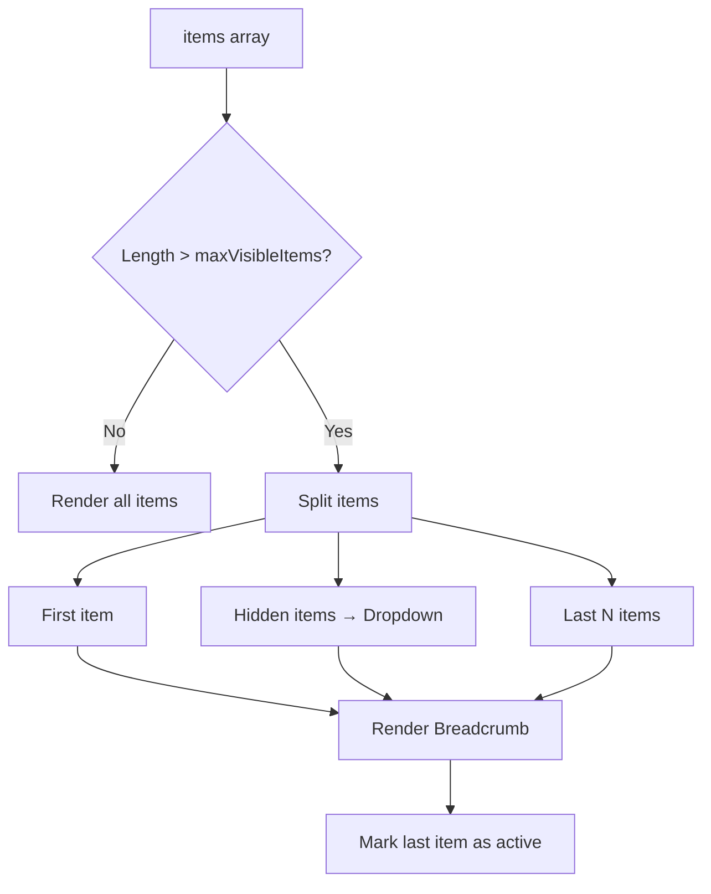

# Design Document: React Breadcrumbs Components

## Overview

This design document specifies the implementation of Breadcrumb navigation components for the Yasamen React library. The implementation ports functionality from the existing Razor/Blazor Breadcrumb components while adapting to React patterns and the existing Yasamen architecture.

The breadcrumb system provides a compound component API for creating hierarchical navigation trails. It supports both manual composition with `Breadcrumb.Item` and automatic management through the smart `Breadcrumbs` component with overflow handling for long navigation paths.

### Key Design Principles

1. **Compound Component Pattern**: Use `Breadcrumb.Item` for manual composition and `Breadcrumbs` for data-driven usage
2. **React Router Integration**: Seamless integration with react-router-dom for navigation
3. **Overflow Management**: Automatic dropdown menu for hidden items when trail exceeds maxVisibleItems
4. **Accessibility First**: Implement proper ARIA labels, semantic HTML, and keyboard navigation
5. **Consistency**: Follow existing Yasamen patterns (Dropdown integration, CSS classes, TypeScript types)

## Architecture

### Component Hierarchy

```
Breadcrumb (namespace)
├── BreadcrumbItem (individual breadcrumb link/text)

Breadcrumbs (smart component)
├── Uses Breadcrumb container
├── Uses BreadcrumbItem for visible items
└── Uses Dropdown.IconButton + Dropdown.Menu for overflow

Supporting Infrastructure:
├── BreadcrumbData (TypeScript interface)
└── breadcrumb-classes.ts (CSS class mappings)
```

### Data Flow for Smart Breadcrumbs



### Navigation Flow

```mermaid
sequenceDiagram
    participant User
    participant BreadcrumbItem
    participant Link
    participant Router
    participant Target

    User->>BreadcrumbItem: Click
    alt Has href
        BreadcrumbItem->>Link: Navigate with state
        Link->>Router: Push route
        Router->>Target: Render with state
    else Has onClick
        BreadcrumbItem->>onClick: Invoke callback
    end
```

## Components and Interfaces

### 1. Breadcrumb Namespace (Compound Component)

The main export that provides the compound component API.

```typescript
// Breadcrumb.tsx
import BreadcrumbContainer from './BreadcrumbContainer';
import BreadcrumbItem from './BreadcrumbItem';

const Breadcrumb = Object.assign(BreadcrumbContainer, {
    Item: BreadcrumbItem,
});

export default Breadcrumb;
```

**Usage Example**:
```typescript
<Breadcrumb>
    <Breadcrumb.Item href="/">Home</Breadcrumb.Item>
    <Breadcrumb.Item href="/products">Products</Breadcrumb.Item>
    <Breadcrumb.Item active>Current Page</Breadcrumb.Item>
</Breadcrumb>
```

### 2. BreadcrumbContainer Component

The container component that renders the semantic nav and ol structure.

```typescript
// BreadcrumbContainer.tsx
export interface BreadcrumbContainerProps {
    children: React.ReactNode;
    className?: string;
    ariaLabel?: string;
}

const BreadcrumbContainer: React.FC<BreadcrumbContainerProps> = ({
    children,
    className = '',
    ariaLabel = 'breadcrumb',
}) => {
    const classes = [
        BreadcrumbClasses.Container,
        className
    ].filter(Boolean).join(' ');

    return (
        <nav aria-label={ariaLabel} className={classes}>
            <ol className={BreadcrumbClasses.List}>
                {children}
            </ol>
        </nav>
    );
};

export default BreadcrumbContainer;
```

### 3. BreadcrumbItem Component

Individual breadcrumb item with support for links, buttons, and text.

```typescript
// BreadcrumbItem.tsx
import { Link } from 'react-router-dom';

export interface BreadcrumbItemProps {
    children: React.ReactNode;
    href?: string;
    state?: any;
    onClick?: () => void;
    active?: boolean;
    className?: string;
}

const BreadcrumbItem: React.FC<BreadcrumbItemProps> = ({
    children,
    href,
    state,
    onClick,
    active = false,
    className = '',
}) => {
    const linkClasses = [
        BreadcrumbClasses.Link,
        active ? BreadcrumbClasses.Active : '',
        className
    ].filter(Boolean).join(' ');

    const renderContent = () => {
        // Priority: href > onClick > span
        if (href) {
            return (
                <Link
                    to={href}
                    state={state}
                    className={linkClasses}
                    aria-current={active ? 'page' : undefined}
                >
                    {children}
                </Link>
            );
        }

        if (onClick) {
            return (
                <button
                    type="button"
                    onClick={onClick}
                    className={linkClasses}
                    aria-current={active ? 'page' : undefined}
                >
                    {children}
                </button>
            );
        }

        return (
            <span
                className={linkClasses}
                aria-current={active ? 'page' : undefined}
            >
                {children}
            </span>
        );
    };

    return (
        <li className={BreadcrumbClasses.Item}>
            {renderContent()}
        </li>
    );
};

export default BreadcrumbItem;
```

### 4. BreadcrumbData Interface

TypeScript interface for breadcrumb data objects.

```typescript
// breadcrumb-types.ts
export interface BreadcrumbData {
    /** Display text for the breadcrumb item */
    text: string;
    
    /** Optional URL for navigation (uses React Router Link) */
    href?: string;
    
    /** Optional state object to pass during navigation */
    state?: any;
    
    /** Optional click handler (used when href is not provided) */
    onClick?: () => void;
}
```

### 5. Breadcrumbs Smart Component

Data-driven component with automatic overflow handling.

```typescript
// Breadcrumbs.tsx
import Breadcrumb from './Breadcrumb';
import Dropdown from '../dropdown/Dropdown';
import { BreadcrumbData } from './breadcrumb-types';

export interface BreadcrumbsProps {
    /** Array of breadcrumb data objects */
    items: BreadcrumbData[];
    
    /** Maximum number of visible items before creating overflow menu */
    maxVisibleItems?: number;
    
    /** Custom className for the breadcrumb container */
    className?: string;
    
    /** Custom aria-label for the nav element */
    ariaLabel?: string;
}

const Breadcrumbs: React.FC<BreadcrumbsProps> = ({
    items,
    maxVisibleItems = 5,
    className,
    ariaLabel,
}) => {
    // Handle empty or invalid data
    if (!items || items.length === 0) {
        if (process.env.NODE_ENV === 'development') {
            console.warn('Breadcrumbs: items array is empty or undefined');
        }
        return null;
    }

    // Single item - render as active without link
    if (items.length === 1) {
        return (
            <Breadcrumb className={className} ariaLabel={ariaLabel}>
                <Breadcrumb.Item active>
                    {items[0].text}
                </Breadcrumb.Item>
            </Breadcrumb>
        );
    }

    // All items fit - render normally
    if (items.length <= maxVisibleItems) {
        return (
            <Breadcrumb className={className} ariaLabel={ariaLabel}>
                {items.map((item, index) => {
                    const isLast = index === items.length - 1;
                    return (
                        <Breadcrumb.Item
                            key={index}
                            href={item.href}
                            state={item.state}
                            onClick={item.onClick}
                            active={isLast}
                        >
                            {item.text}
                        </Breadcrumb.Item>
                    );
                })}
            </Breadcrumb>
        );
    }

    // Overflow handling
    // Show: first item + dropdown + last (maxVisibleItems - 2) items
    const firstItem = items[0];
    const lastItems = items.slice(-(maxVisibleItems - 2));
    const hiddenItems = items.slice(1, -(maxVisibleItems - 2));

    return (
        <Breadcrumb className={className} ariaLabel={ariaLabel}>
            {/* First item */}
            <Breadcrumb.Item
                href={firstItem.href}
                state={firstItem.state}
                onClick={firstItem.onClick}
            >
                {firstItem.text}
            </Breadcrumb.Item>

            {/* Overflow dropdown */}
            <li className={BreadcrumbClasses.Item}>
                <Dropdown.IconButton
                    icon="ellipsis-h"
                    theme={Themes.Link}
                    size={Sizes.Small}
                    className={BreadcrumbClasses.Dropdown}
                    aria-label="Show hidden breadcrumbs"
                >
                    <Dropdown.Menu>
                        {hiddenItems.map((item, index) => (
                            <Dropdown.Item
                                key={index}
                                onClick={() => {
                                    if (item.onClick) {
                                        item.onClick();
                                    } else if (item.href) {
                                        // Navigation handled by Link in dropdown item
                                        // We'll need to enhance Dropdown.Item to support href
                                    }
                                }}
                            >
                                {item.text}
                            </Dropdown.Item>
                        ))}
                    </Dropdown.Menu>
                </Dropdown.IconButton>
            </li>

            {/* Last visible items */}
            {lastItems.map((item, index) => {
                const isLast = index === lastItems.length - 1;
                return (
                    <Breadcrumb.Item
                        key={index}
                        href={item.href}
                        state={item.state}
                        onClick={item.onClick}
                        active={isLast}
                    >
                        {item.text}
                    </Breadcrumb.Item>
                );
            })}
        </Breadcrumb>
    );
};

export default Breadcrumbs;
```

### 6. CSS Classes

```typescript
// breadcrumb-classes.ts
export const BreadcrumbClasses = {
    Container: 'ya-breadcrumb',
    List: 'ya-breadcrumb-list',
    Item: 'ya-breadcrumb-item',
    Link: 'ya-breadcrumb-link',
    Active: 'active',
    Dropdown: 'ya-breadcrumb-dropdown',
} as const;

export type BreadcrumbClassesMap = typeof BreadcrumbClasses;
```

## Data Models

### BreadcrumbData Interface

```typescript
export interface BreadcrumbData {
    text: string;
    href?: string;
    state?: any;
    onClick?: () => void;
}
```

**Properties**:
- `text`: Display text for the breadcrumb item (required)
- `href`: Optional URL for navigation using React Router Link
- `state`: Optional state object passed to React Router during navigation
- `onClick`: Optional click handler for custom behavior (used when href is not provided)

**Priority**: When both `href` and `onClick` are provided, `href` takes priority for navigation.

### Component Props Interfaces

```typescript
export interface BreadcrumbContainerProps {
    children: React.ReactNode;
    className?: string;
    ariaLabel?: string;
}

export interface BreadcrumbItemProps {
    children: React.ReactNode;
    href?: string;
    state?: any;
    onClick?: () => void;
    active?: boolean;
    className?: string;
}

export interface BreadcrumbsProps {
    items: BreadcrumbData[];
    maxVisibleItems?: number;
    className?: string;
    ariaLabel?: string;
}
```

## Correctness Properties


*A property is a characteristic or behavior that should hold true across all valid executions of a system—essentially, a formal statement about what the system should do. Properties serve as the bridge between human-readable specifications and machine-verifiable correctness guarantees.*

### Property Reflection

After analyzing all acceptance criteria, I identified the following testable properties and eliminated redundancies:

**Redundancies Eliminated**:
- Requirements 7.1, 10.2 are redundant with 1.1 (aria-label on nav)
- Requirements 7.2, 10.6 are redundant with 2.6 (aria-current on active items)
- Requirements 10.3, 10.4, 10.5, 10.8 are redundant with 2.1, 2.7, 5.4, 1.4 (CSS classes)
- Requirements 12.1, 12.2 are redundant with 2.8 (children support)
- Requirement 6.3 is redundant with 6.1 (Link component usage)
- Requirement 15.1 is redundant with 6.2 (state passing)

**Properties Combined**:
- Properties about element rendering (1.1, 1.2, 1.3) can be combined into a single structural property
- Properties about BreadcrumbItem element types (2.2, 2.3, 2.4) can be combined into a single conditional rendering property
- Properties about active state (2.5, 2.6) can be combined into a single active state property
- Properties about overflow menu structure (5.1, 5.2, 5.3, 5.4) can be combined into a single overflow structure property

### Property 1: Breadcrumb container structure

*For any* Breadcrumb component, when rendered, it should produce a nav element with aria-label="breadcrumb" and CSS class "ya-breadcrumb", containing an ol element with class "ya-breadcrumb-list".

**Validates: Requirements 1.1, 1.2, 1.3**

### Property 2: Custom className application

*For any* custom className string, when passed to Breadcrumb or BreadcrumbItem, the className should appear in the rendered output alongside the base CSS classes.

**Validates: Requirements 1.4**

### Property 3: Children rendering

*For any* React node passed as children to Breadcrumb or BreadcrumbItem, the children should be rendered in the output.

**Validates: Requirements 1.5, 1.6, 2.8**

### Property 4: BreadcrumbItem list item structure

*For any* BreadcrumbItem, when rendered, it should produce an li element with CSS class "ya-breadcrumb-item".

**Validates: Requirements 2.1**

### Property 5: BreadcrumbItem conditional element rendering

*For any* BreadcrumbItem, when it has an href prop, a Link component should be rendered; when it has onClick but no href, a button element should be rendered; when it has neither, a span element should be rendered.

**Validates: Requirements 2.2, 2.3, 2.4, 6.1**

### Property 6: Active state styling and ARIA

*For any* BreadcrumbItem with active=true, the inner element (link/button/span) should have the "active" CSS class and aria-current="page" attribute.

**Validates: Requirements 2.5, 2.6**

### Property 7: Breadcrumb link CSS class

*For any* BreadcrumbItem, the inner element (link/button/span) should have the CSS class "ya-breadcrumb-link".

**Validates: Requirements 2.7**

### Property 8: BreadcrumbItem onClick invocation

*For any* BreadcrumbItem with an onClick callback, when the item is clicked, the onClick callback should be invoked.

**Validates: Requirements 2.9**

### Property 9: Breadcrumbs renders all items when within limit

*For any* items array with length <= maxVisibleItems, the Breadcrumbs component should render all items as BreadcrumbItem components without an overflow menu.

**Validates: Requirements 4.1, 4.2**

### Property 10: Breadcrumbs overflow structure

*For any* items array with length > maxVisibleItems, the Breadcrumbs component should render the first item, a Dropdown.IconButton with ellipsis icon and class "ya-breadcrumb-dropdown", a Dropdown.Menu containing the hidden items as Dropdown.Item components, and the last (maxVisibleItems - 2) items.

**Validates: Requirements 4.3, 4.4, 5.1, 5.2, 5.3, 5.4**

### Property 11: Last item marked as active

*For any* items array with length > 1, the Breadcrumbs component should mark the last item as active.

**Validates: Requirements 4.5**

### Property 12: Item href renders as link

*For any* BreadcrumbData item with an href property, the Breadcrumbs component should render it as a Link component.

**Validates: Requirements 4.6**

### Property 13: Item onClick invocation in Breadcrumbs

*For any* BreadcrumbData item with an onClick property, when the item is clicked, the onClick callback should be invoked.

**Validates: Requirements 4.7**

### Property 14: href priority over onClick

*For any* BreadcrumbData item with both href and onClick properties, the Breadcrumbs component should render a Link component (href takes priority).

**Validates: Requirements 4.8**

### Property 15: Overflow menu item navigation

*For any* overflow menu item with href, when clicked, the system should navigate to the href; for any overflow menu item with onClick, when clicked, the onClick callback should be invoked.

**Validates: Requirements 5.5, 5.6**

### Property 16: Overflow menu closes after click

*For any* overflow menu item, when clicked, the dropdown menu should close.

**Validates: Requirements 5.7**

### Property 17: State passed to Link component

*For any* BreadcrumbData item with both href and state properties, the state should be passed to the Link component as the state prop.

**Validates: Requirements 6.2**

### Property 18: Breadcrumbs text rendering

*For any* BreadcrumbData item, the text property should appear in the rendered output.

**Validates: Requirements 12.3**

### Property 19: Empty items array handling

*For any* Breadcrumbs component with an empty or undefined items array, the component should render null and log a warning in development mode.

**Validates: Requirements 14.1, 14.2, 14.4, 14.5**

### Property 20: Single item rendering

*For any* Breadcrumbs component with a single-item array, the component should render that item as an active breadcrumb without a link (span element).

**Validates: Requirements 14.3**

## Error Handling

### Invalid Props

- **Empty items array**: Breadcrumbs component should return null and log a warning in development mode
- **Undefined items prop**: Breadcrumbs component should return null and log a warning in development mode
- **Single item array**: Breadcrumbs component should render the item as active text (span) without navigation
- **Invalid maxVisibleItems**: If maxVisibleItems is less than 3, default to 3 (minimum for overflow: first + dropdown + last)
- **Missing text property**: If a BreadcrumbData item is missing the text property, render empty string and log warning

### Navigation Errors

- **Invalid href**: If href is an empty string, render as span instead of Link
- **onClick errors**: Wrap onClick handlers in try-catch to prevent component from breaking if user code throws
- **State serialization**: No validation on state object - React Router handles serialization

### Overflow Calculation Errors

- **maxVisibleItems = 1**: Should show only the last item as active
- **maxVisibleItems = 2**: Should show first and last items without overflow
- **Negative maxVisibleItems**: Default to 5

### Component Composition Errors

- **BreadcrumbItem outside Breadcrumb**: Should still render correctly (no context dependency)
- **Non-BreadcrumbItem children in Breadcrumb**: Should render as-is (flexible children support)

## Testing Strategy

### Unit Tests

Unit tests will focus on specific examples, edge cases, and error conditions:

1. **Component Rendering**
   - Breadcrumb renders with correct nav and ol structure
   - BreadcrumbItem renders with correct li and inner element
   - Breadcrumbs renders correct number of items
   - Custom className is applied correctly

2. **Edge Cases**
   - Empty items array returns null
   - Undefined items prop returns null
   - Single item renders as active span
   - maxVisibleItems = 1, 2, 3 edge cases
   - Negative or zero maxVisibleItems
   - Items array with only one item having href

3. **Error Conditions**
   - onClick throws error doesn't break component
   - Missing text property in BreadcrumbData
   - Invalid href (empty string)
   - Development mode warnings are logged

4. **Integration**
   - Breadcrumb + BreadcrumbItem work together
   - Breadcrumbs + Dropdown components work together
   - React Router Link integration
   - State passing through navigation

### Property-Based Tests

Property-based tests will verify universal properties across all inputs. Each test should run a minimum of 100 iterations using fast-check.

1. **Property 1: Breadcrumb container structure**
   - Generate random Breadcrumb components
   - Verify nav with aria-label and ol structure

2. **Property 2: Custom className application**
   - Generate random className strings
   - Verify className appears alongside base classes

3. **Property 3: Children rendering**
   - Generate random React nodes as children
   - Verify children appear in output

4. **Property 4: BreadcrumbItem list item structure**
   - Generate random BreadcrumbItem components
   - Verify li element with correct class

5. **Property 5: BreadcrumbItem conditional element rendering**
   - Generate random combinations of href/onClick/neither
   - Verify correct element type (Link/button/span)

6. **Property 6: Active state styling and ARIA**
   - Generate random BreadcrumbItem with active=true
   - Verify active class and aria-current="page"

7. **Property 7: Breadcrumb link CSS class**
   - Generate random BreadcrumbItem components
   - Verify ya-breadcrumb-link class on inner element

8. **Property 8: BreadcrumbItem onClick invocation**
   - Generate random BreadcrumbItem with onClick
   - Click and verify callback invoked

9. **Property 9: Breadcrumbs renders all items when within limit**
   - Generate random items arrays with length <= maxVisibleItems
   - Verify all items rendered, no overflow menu

10. **Property 10: Breadcrumbs overflow structure**
    - Generate random items arrays with length > maxVisibleItems
    - Verify first item, dropdown, and last N items structure

11. **Property 11: Last item marked as active**
    - Generate random items arrays with length > 1
    - Verify last item has active=true

12. **Property 12: Item href renders as link**
    - Generate random items with href
    - Verify Link component rendered

13. **Property 13: Item onClick invocation in Breadcrumbs**
    - Generate random items with onClick
    - Click and verify callback invoked

14. **Property 14: href priority over onClick**
    - Generate random items with both href and onClick
    - Verify Link rendered (not button)

15. **Property 15: Overflow menu item navigation**
    - Generate random overflow scenarios
    - Click overflow items and verify navigation/onClick

16. **Property 16: Overflow menu closes after click**
    - Generate random overflow scenarios
    - Click overflow item and verify dropdown closes

17. **Property 17: State passed to Link component**
    - Generate random items with href and state
    - Verify state prop passed to Link

18. **Property 18: Breadcrumbs text rendering**
    - Generate random items with text
    - Verify text appears in output

19. **Property 19: Empty items array handling**
    - Generate empty/undefined items arrays
    - Verify null returned and warning logged

20. **Property 20: Single item rendering**
    - Generate single-item arrays
    - Verify item rendered as active span

### Test Tagging

Each property test must include a comment tag referencing the design document property:

```typescript
// Feature: react-breadcrumbs-components, Property 1: Breadcrumb container structure
test('breadcrumb container structure', () => {
    fc.assert(
        fc.property(fc.array(fc.string()), (children) => {
            // Test implementation
        }),
        { numRuns: 100 }
    );
});
```

### Testing Tools

- **Unit Tests**: Vitest + React Testing Library
- **Property Tests**: fast-check (property-based testing library for TypeScript)
- **Accessibility Tests**: @testing-library/jest-dom for ARIA assertions
- **User Interaction**: @testing-library/user-event for realistic user interactions
- **Router Testing**: React Router's MemoryRouter for navigation testing
