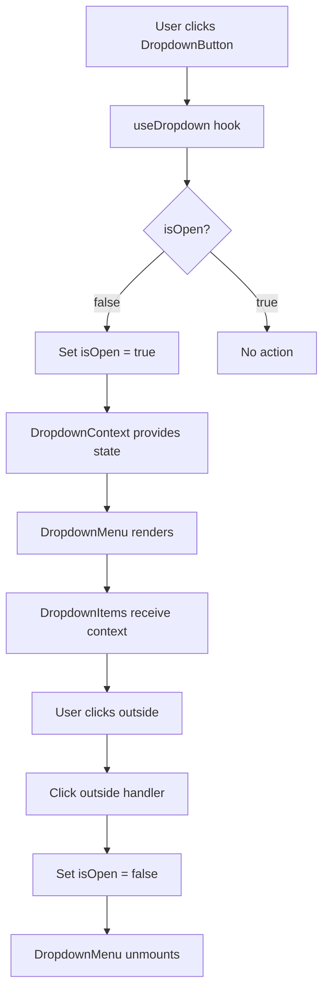
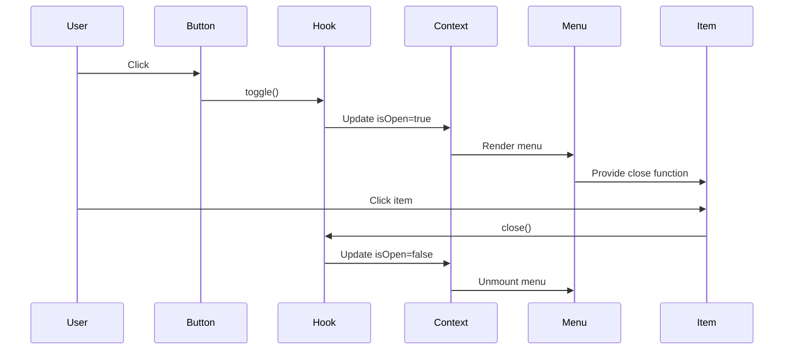

# Design Document: React Dropdown Components

## Overview

This design document specifies the implementation of Dropdown/Menu components for the Yasamen React library. The implementation ports functionality from the existing Razor/Blazor Dropdown components while adapting to React patterns and the existing Yasamen architecture.

The dropdown system provides a compound component API for creating interactive menus triggered by buttons. It supports flexible positioning, multiple close behaviors, accessibility features, and programmatic control through handlers.

### Key Design Principles

1. **Compound Component Pattern**: Use `Dropdown.Button`, `Dropdown.IconButton`, `Dropdown.Item`, and `Dropdown.Menu` for intuitive composition
2. **Context-Based State**: Share dropdown state through React Context to avoid prop drilling
3. **CSS-Based Positioning**: Use CSS classes for positioning rather than JavaScript calculations
4. **Accessibility First**: Implement proper ARIA roles, keyboard navigation, and focus management
5. **Consistency**: Follow existing Yasamen patterns (ButtonClasses, hooks, context, compound components)

## Architecture

### Component Hierarchy

```
Dropdown (namespace)
├── DropdownButton (wraps Button + dropdown logic)
├── DropdownIconButton (wraps IconButton + dropdown logic)
├── DropdownMenu (container for dropdown content)
└── DropdownItem (individual menu items)

Supporting Infrastructure:
├── useDropdown (hook for state management)
├── DropdownContext (context for sharing state)
├── DropdownHandler (programmatic control interface)
└── dropdown-classes.ts (CSS class mappings)
```

### State Management Flow



### Event Flow



## Components and Interfaces

### 1. Dropdown Namespace (Compound Component)

The main export that provides the compound component API.

```typescript
// Dropdown.tsx
import DropdownButton from './DropdownButton';
import DropdownIconButton from './DropdownIconButton';
import DropdownMenu from './DropdownMenu';
import DropdownItem from './DropdownItem';

const Dropdown = {
    Button: DropdownButton,
    IconButton: DropdownIconButton,
    Menu: DropdownMenu,
    Item: DropdownItem,
};

export default Dropdown;
```

**Usage Example**:
```typescript
<Dropdown.Button label="Actions" theme={Themes.Primary}>
    <Dropdown.Menu>
        <Dropdown.Item onClick={() => console.log('Edit')}>Edit</Dropdown.Item>
        <Dropdown.Item onClick={() => console.log('Delete')}>Delete</Dropdown.Item>
    </Dropdown.Menu>
</Dropdown.Button>
```

### 2. DropdownButton Component

Wraps the Button component with dropdown functionality.

```typescript
// DropdownButton.tsx
export interface DropdownButtonProps extends Omit<ButtonProps, 'onClick'> {
    // Dropdown-specific props
    direction?: Directions;
    align?: Positions;
    minWidth?: Sizes;
    closeBehavior?: DropCloseBehavior;
    contentType?: DropContentType;
    onOpened?: () => void;
    onClosed?: () => void;
    handler?: DropdownHandler;
    dropdownClassName?: string;
    
    // Children must include DropdownMenu
    children: React.ReactNode;
}

const DropdownButton: React.FC<DropdownButtonProps> = ({
    direction = Directions.Down,
    align = Positions.Start,
    minWidth,
    closeBehavior = DropCloseBehavior.CloseOnClickOutside,
    contentType = DropContentType.List,
    onOpened,
    onClosed,
    handler,
    dropdownClassName,
    children,
    ...buttonProps
}) => {
    const { isOpen, open, close, toggle, dropdownRef, triggerRef } = useDropdown({
        closeBehavior,
        onOpened,
        onClosed,
    });

    // Connect handler if provided
    useEffect(() => {
        if (handler) {
            handler.open = open;
            handler.close = close;
            handler.isOpen = isOpen;
        }
    }, [handler, open, close, isOpen]);

    const handleButtonClick = (e: React.MouseEventHandler<HTMLButtonElement>) => {
        if (!isOpen) {
            open();
        }
    };

    return (
        <DropdownContext.Provider value={{ isOpen, close, closeBehavior, contentType }}>
            <div className="ya-drop" ref={dropdownRef}>
                <Button
                    {...buttonProps}
                    onClick={handleButtonClick}
                    aria-expanded={isOpen}
                    aria-haspopup="true"
                    ref={triggerRef}
                />
                {children}
            </div>
        </DropdownContext.Provider>
    );
};
```

### 3. DropdownIconButton Component

Wraps the IconButton component with dropdown functionality.

```typescript
// DropdownIconButton.tsx
export interface DropdownIconButtonProps extends Omit<IconButtonProps, 'onClick'> {
    // Same dropdown-specific props as DropdownButton
    direction?: Directions;
    align?: Positions;
    minWidth?: Sizes;
    closeBehavior?: DropCloseBehavior;
    contentType?: DropContentType;
    onOpened?: () => void;
    onClosed?: () => void;
    handler?: DropdownHandler;
    dropdownClassName?: string;
    children: React.ReactNode;
}

// Implementation follows same pattern as DropdownButton
```

### 4. DropdownMenu Component

Container for dropdown content with positioning and visibility logic.

```typescript
// DropdownMenu.tsx
export interface DropdownMenuProps {
    children: React.ReactNode;
    className?: string;
}

const DropdownMenu: React.FC<DropdownMenuProps> = ({ children, className = '' }) => {
    const { isOpen, contentType } = useDropdownContext();

    if (!isOpen) {
        return null;
    }

    const Element = contentType === DropContentType.List ? 'ul' : 'div';
    const role = contentType === DropContentType.List ? 'menu' : undefined;

    const classes = [
        DropdownClasses.Menu.Base,
        DropdownClasses.Menu.Open,
        className
    ].filter(Boolean).join(' ');

    return (
        <Element className={classes} role={role}>
            {children}
        </Element>
    );
};
```

### 5. DropdownItem Component

Individual menu item with click handling and close behavior.

```typescript
// DropdownItem.tsx
export interface DropdownItemProps {
    children: React.ReactNode;
    onClick?: () => void;
    disabled?: boolean;
    className?: string;
}

const DropdownItem: React.FC<DropdownItemProps> = ({
    children,
    onClick,
    disabled = false,
    className = ''
}) => {
    const { close, closeBehavior, contentType } = useDropdownContext();

    const handleClick = () => {
        if (disabled) return;
        
        if (onClick) {
            onClick();
        }

        if (closeBehavior === DropCloseBehavior.CloseOnClick) {
            close();
        }
    };

    const Element = contentType === DropContentType.List ? 'li' : 'div';
    const role = contentType === DropContentType.List ? 'menuitem' : 'button';

    const classes = [
        DropdownClasses.Item.Base,
        disabled ? DropdownClasses.Item.Disabled : '',
        className
    ].filter(Boolean).join(' ');

    return (
        <Element
            className={classes}
            role={role}
            onClick={handleClick}
            aria-disabled={disabled}
        >
            {children}
        </Element>
    );
};
```

### 6. useDropdown Hook

Manages dropdown state and user interactions.

```typescript
// use-dropdown.ts
export interface UseDropdownOptions {
    closeBehavior: DropCloseBehavior;
    onOpened?: () => void;
    onClosed?: () => void;
}

export interface UseDropdownReturn {
    isOpen: boolean;
    open: () => void;
    close: () => void;
    toggle: () => void;
    dropdownRef: React.RefObject<HTMLDivElement>;
    triggerRef: React.RefObject<HTMLButtonElement>;
}

export function useDropdown(options: UseDropdownOptions): UseDropdownReturn {
    const [isOpen, setIsOpen] = useState(false);
    const dropdownRef = useRef<HTMLDivElement>(null);
    const triggerRef = useRef<HTMLButtonElement>(null);

    const open = useCallback(() => {
        setIsOpen(true);
        options.onOpened?.();
    }, [options]);

    const close = useCallback(() => {
        setIsOpen(false);
        options.onClosed?.();
    }, [options]);

    const toggle = useCallback(() => {
        if (isOpen) {
            close();
        } else {
            open();
        }
    }, [isOpen, open, close]);

    // Click outside handler
    useEffect(() => {
        if (!isOpen || options.closeBehavior === DropCloseBehavior.CloseManually) {
            return;
        }

        const handleClickOutside = (event: MouseEvent) => {
            if (dropdownRef.current && !dropdownRef.current.contains(event.target as Node)) {
                if (options.closeBehavior === DropCloseBehavior.CloseOnClickOutside) {
                    close();
                }
            } else if (dropdownRef.current && dropdownRef.current.contains(event.target as Node)) {
                if (options.closeBehavior === DropCloseBehavior.CloseOnClick) {
                    close();
                }
            }
        };

        document.addEventListener('mousedown', handleClickOutside);
        return () => document.removeEventListener('mousedown', handleClickOutside);
    }, [isOpen, close, options.closeBehavior]);

    // Escape key handler
    useEffect(() => {
        if (!isOpen) return;

        const handleEscape = (event: KeyboardEvent) => {
            if (event.key === 'Escape') {
                close();
                triggerRef.current?.focus();
            }
        };

        document.addEventListener('keydown', handleEscape);
        return () => document.removeEventListener('keydown', handleEscape);
    }, [isOpen, close]);

    return {
        isOpen,
        open,
        close,
        toggle,
        dropdownRef,
        triggerRef,
    };
}
```

### 7. DropdownContext

Provides dropdown state to child components.

```typescript
// dropdown-context.ts
export interface DropdownContextValue {
    isOpen: boolean;
    close: () => void;
    closeBehavior: DropCloseBehavior;
    contentType: DropContentType;
}

export const DropdownContext = createContext<DropdownContextValue | null>(null);

export function useDropdownContext(): DropdownContextValue {
    const context = useContext(DropdownContext);
    if (!context) {
        throw new Error('useDropdownContext must be used within a Dropdown component');
    }
    return context;
}
```

### 8. DropdownHandler

Interface for programmatic control.

```typescript
// DropdownHandler.ts
export interface DropdownHandler {
    open: () => void;
    close: () => void;
    isOpen: boolean;
}

export function createDropdownHandler(): DropdownHandler {
    return {
        open: () => {},
        close: () => {},
        isOpen: false,
    };
}
```

## Data Models

### Enums and Types

```typescript
// dropdown-types.ts

export const Directions = {
    Up: 'up',
    Down: 'down',
    Left: 'left',
    Right: 'right',
} as const;

export type Directions = typeof Directions[keyof typeof Directions];

export const DropCloseBehavior = {
    CloseOnClick: 'close-on-click',
    CloseOnClickOutside: 'close-on-click-outside',
    CloseManually: 'close-manually',
} as const;

export type DropCloseBehavior = typeof DropCloseBehavior[keyof typeof DropCloseBehavior];

export const DropContentType = {
    List: 'list',
    Custom: 'custom',
} as const;

export type DropContentType = typeof DropContentType[keyof typeof DropContentType];
```

### CSS Classes

```typescript
// dropdown-classes.ts
import { Directions, Positions, Sizes } from '../commons';

export const DropdownClasses = {
    Base: 'ya-drop',
    Menu: {
        Base: 'ya-drop-menu',
        Open: 'ya-drop-menu-open',
        Closed: 'ya-drop-menu-closed',
        Direction: {
            [Directions.Up]: 'ya-drop-up',
            [Directions.Down]: 'ya-drop-down',
            [Directions.Left]: 'ya-drop-left',
            [Directions.Right]: 'ya-drop-right',
        },
        Align: {
            [Positions.Start]: 'ya-drop-align-start',
            [Positions.Center]: 'ya-drop-align-center',
            [Positions.End]: 'ya-drop-align-end',
        },
        MinWidth: {
            [Sizes.Smallest]: 'ya-drop-min-w-2xs',
            [Sizes.Smaller]: 'ya-drop-min-w-xs',
            [Sizes.Small]: 'ya-drop-min-w-sm',
            [Sizes.Medium]: 'ya-drop-min-w-md',
            [Sizes.Large]: 'ya-drop-min-w-lg',
            [Sizes.Larger]: 'ya-drop-min-w-xl',
            [Sizes.Largest]: 'ya-drop-min-w-2xl',
        },
    },
    Item: {
        Base: 'ya-drop-item',
        Disabled: 'ya-drop-item-disabled',
    },
} as const;

export type DropdownClassesMap = typeof DropdownClasses;
```

## Correctness Properties

*A property is a characteristic or behavior that should hold true across all valid executions of a system—essentially, a formal statement about what the system should do. Properties serve as the bridge between human-readable specifications and machine-verifiable correctness guarantees.*

### Property 1: Button props pass-through

*For any* DropdownButton or DropdownIconButton with any combination of button props (theme, size, icon, outline, active, block, disabled), all props should be correctly passed to the underlying Button or IconButton component and reflected in the rendered output.

**Validates: Requirements 1.1, 1.6, 2.1, 2.4**

### Property 2: Dropdown opens only when closed

*For any* dropdown component (DropdownButton or DropdownIconButton), when the trigger button is clicked and the dropdown is currently closed, the dropdown should transition to the open state.

**Validates: Requirements 1.2, 2.2**

### Property 3: Dropdown does not re-open when already open

*For any* dropdown component (DropdownButton or DropdownIconButton), when the trigger button is clicked and the dropdown is currently open, the dropdown should remain in the open state without triggering additional open actions.

**Validates: Requirements 1.3, 2.3**

### Property 4: Click outside closes dropdown

*For any* dropdown with closeBehavior set to CloseOnClickOutside, when a click event occurs outside the dropdown element while the dropdown is open, the dropdown should close.

**Validates: Requirements 4.5**

### Property 5: Escape key closes dropdown and returns focus

*For any* open dropdown, when the Escape key is pressed, the dropdown should close and focus should return to the trigger button.

**Validates: Requirements 4.6, 10.5**

### Property 6: Click item closes dropdown with CloseOnClick behavior

*For any* dropdown with closeBehavior set to CloseOnClick, when a DropdownItem is clicked, the dropdown should close after executing the item's onClick handler.

**Validates: Requirements 3.4, 4.7**

### Property 7: Manual close behavior prevents automatic closing

*For any* dropdown with closeBehavior set to CloseManually, when any user interaction occurs (click outside, click inside, Escape key), the dropdown should remain open.

**Validates: Requirements 4.8**

### Property 8: Element type matches contentType

*For any* DropdownItem or DropdownMenu, when contentType is List, the components should render as ul/li elements with role="menu"/"menuitem", and when contentType is Custom, they should render as div elements with appropriate roles.

**Validates: Requirements 3.1, 3.2, 7.1, 7.2**

### Property 9: Dropdown menu visibility matches isOpen state

*For any* dropdown, when isOpen is false, the DropdownMenu should not be rendered in the DOM, and when isOpen is true, the DropdownMenu should be rendered with appropriate CSS classes.

**Validates: Requirements 7.3, 7.4**

### Property 10: Handler methods control dropdown state

*For any* dropdown with an attached DropdownHandler, when the handler's open() method is called, the dropdown should open, when the handler's close() method is called, the dropdown should close, and the handler's isOpen property should always reflect the current state.

**Validates: Requirements 9.2, 9.3, 9.4**

### Property 11: ARIA expanded attribute reflects dropdown state

*For any* dropdown trigger button, when the dropdown is open, aria-expanded should be "true", and when the dropdown is closed, aria-expanded should be "false".

**Validates: Requirements 10.3, 10.4**

### Property 12: Disabled items do not trigger actions

*For any* DropdownItem with disabled set to true, when the item is clicked, the onClick handler should not be invoked and the dropdown should not close.

**Validates: Requirements 3.6**

### Property 13: Context provides complete state to all children

*For any* component within a Dropdown tree, when accessing the DropdownContext, the component should receive the current isOpen state, close function, closeBehavior, and contentType.

**Validates: Requirements 5.1, 5.2, 5.3, 5.4**

### Property 14: Callbacks are invoked on state changes

*For any* dropdown with onOpened and onClosed callbacks, when the dropdown opens, onOpened should be invoked exactly once, and when the dropdown closes, onClosed should be invoked exactly once.

**Validates: Requirements 1.4, 1.5**

### Property 15: CSS classes applied based on configuration

*For any* dropdown with specified direction, align, and minWidth props, the DropdownMenu should have the corresponding CSS classes from DropdownClasses.Menu.Direction, DropdownClasses.Menu.Align, and DropdownClasses.Menu.MinWidth applied.

**Validates: Requirements 6.1, 6.2, 6.3, 6.4, 6.5, 6.6, 6.7, 6.8, 11.2**

### Property 16: Custom className is applied

*For any* DropdownMenu with a custom className prop, the custom className should be applied to the rendered element in addition to the base dropdown classes.

**Validates: Requirements 7.5, 11.5**

### Property 17: Item onClick callback is invoked

*For any* DropdownItem with an onClick callback, when the item is clicked and not disabled, the onClick callback should be invoked before any close behavior is executed.

**Validates: Requirements 3.3**

### Property 18: Toggle function inverts state

*For any* dropdown, when the toggle function is called, the isOpen state should be inverted (false → true, true → false).

**Validates: Requirements 4.4**

### Property 19: ARIA roles are correctly applied

*For any* dropdown component, the trigger button should have aria-haspopup="true", menu elements should have role="menu", and menu items should have role="menuitem" or role="button" based on contentType.

**Validates: Requirements 10.1, 10.2**

### Property 20: Tab navigation follows logical order

*For any* open dropdown with multiple items, when the user presses Tab, focus should move through dropdown items in DOM order.

**Validates: Requirements 10.6**

## Error Handling

### Invalid Props

- **Missing children**: DropdownButton and DropdownIconButton should throw an error if children prop is not provided
- **Invalid direction**: If direction prop is not one of the valid Directions values, default to Directions.Down
- **Invalid align**: If align prop is not one of the valid Positions values, default to Positions.Start
- **Invalid closeBehavior**: If closeBehavior is not one of the valid values, default to DropCloseBehavior.CloseOnClickOutside

### Context Errors

- **Missing context**: useDropdownContext should throw a descriptive error if called outside a Dropdown component
- **Error message**: "useDropdownContext must be used within a Dropdown component"

### Handler Errors

- **Null handler**: If handler prop is provided but is null/undefined, log a warning and continue without handler
- **Handler method calls before mount**: Handler methods should be no-ops if called before the component is mounted

### Event Handler Errors

- **onClick errors**: Wrap DropdownItem onClick handlers in try-catch to prevent dropdown from breaking if user code throws
- **Callback errors**: Wrap onOpened and onClosed callbacks in try-catch to prevent state corruption

## Testing Strategy

### Unit Tests

Unit tests will focus on specific examples, edge cases, and error conditions:

1. **Component Rendering**
   - DropdownButton renders with correct button props
   - DropdownIconButton renders with correct icon button props
   - DropdownMenu renders when open, doesn't render when closed
   - DropdownItem renders with correct element type based on contentType

2. **Edge Cases**
   - Disabled DropdownItem doesn't trigger onClick
   - Multiple dropdowns on same page don't interfere
   - Rapid clicking doesn't cause state corruption
   - Handler methods work before and after mount

3. **Error Conditions**
   - useDropdownContext throws error outside Dropdown
   - Invalid prop values fall back to defaults
   - onClick errors don't break dropdown

4. **Integration**
   - DropdownButton + DropdownMenu + DropdownItem work together
   - Handler controls dropdown from external code
   - Context provides correct values to all children

### Property-Based Tests

Property-based tests will verify universal properties across all inputs. Each test should run a minimum of 100 iterations.

1. **Property 1: Button props pass-through**
   - Generate random button prop combinations
   - Render DropdownButton/DropdownIconButton
   - Verify all props are applied to underlying button

2. **Property 2: Dropdown opens only when closed**
   - Generate random dropdown states (open/closed)
   - Click trigger button
   - Verify state transitions correctly

3. **Property 3: Dropdown does not re-open when already open**
   - Generate random open dropdowns
   - Click trigger button multiple times
   - Verify no additional open actions

4. **Property 4: Click outside closes dropdown**
   - Generate random open dropdowns with CloseOnClickOutside
   - Simulate clicks at random coordinates outside dropdown
   - Verify dropdown closes

5. **Property 5: Escape key closes dropdown and returns focus**
   - Generate random open dropdowns
   - Simulate Escape key press
   - Verify dropdown closes and focus returns to trigger

6. **Property 6: Click item closes dropdown with CloseOnClick behavior**
   - Generate random dropdowns with CloseOnClick behavior
   - Click random items
   - Verify dropdown closes after onClick

7. **Property 7: Manual close behavior prevents automatic closing**
   - Generate random dropdowns with CloseManually behavior
   - Simulate random user interactions
   - Verify dropdown remains open

8. **Property 8: Element type matches contentType**
   - Generate random contentType values
   - Render DropdownItem and DropdownMenu
   - Verify correct element types and roles

9. **Property 9: Dropdown menu visibility matches isOpen state**
   - Generate random isOpen states
   - Render DropdownMenu
   - Verify DOM presence matches state

10. **Property 10: Handler methods control dropdown state**
    - Generate random handler method calls
    - Verify dropdown state changes correctly and isOpen reflects state

11. **Property 11: ARIA expanded attribute reflects dropdown state**
    - Generate random dropdown states
    - Verify aria-expanded matches isOpen

12. **Property 12: Disabled items do not trigger actions**
    - Generate random disabled items
    - Click items
    - Verify no actions triggered

13. **Property 13: Context provides complete state to all children**
    - Generate random dropdown configurations
    - Access context from children
    - Verify all values are correct

14. **Property 14: Callbacks are invoked on state changes**
    - Generate random state transitions
    - Verify callbacks invoked exactly once at correct times

15. **Property 15: CSS classes applied based on configuration**
    - Generate random direction, align, and minWidth combinations
    - Verify correct CSS classes applied

16. **Property 16: Custom className is applied**
    - Generate random custom classNames
    - Verify className is applied alongside base classes

17. **Property 17: Item onClick callback is invoked**
    - Generate random items with onClick
    - Click items
    - Verify onClick called before close behavior

18. **Property 18: Toggle function inverts state**
    - Generate random dropdown states
    - Call toggle function
    - Verify state is inverted

19. **Property 19: ARIA roles are correctly applied**
    - Generate random dropdown configurations
    - Verify all ARIA roles are present and correct

20. **Property 20: Tab navigation follows logical order**
    - Generate random dropdowns with multiple items
    - Simulate Tab key presses
    - Verify focus moves in DOM order

### Test Tagging

Each property test must include a comment tag referencing the design document property:

```typescript
// Feature: react-dropdown-components, Property 1: Dropdown opens only when closed
test('dropdown opens only when closed', () => {
    fc.assert(
        fc.property(fc.boolean(), (initiallyOpen) => {
            // Test implementation
        }),
        { numRuns: 100 }
    );
});
```

### Testing Tools

- **Unit Tests**: Vitest + React Testing Library
- **Property Tests**: fast-check (property-based testing library for TypeScript)
- **Accessibility Tests**: @testing-library/jest-dom for ARIA assertions
- **User Interaction**: @testing-library/user-event for realistic user interactions
